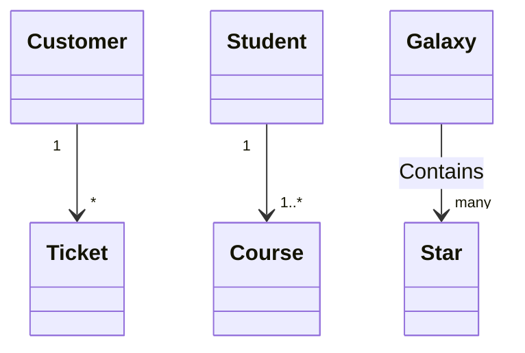

## Diagrams
md-doc supports mermaid diagrams.

```md
classDiagram
    Customer "1" --> "*" Ticket
    Student "1" --> "1..*" Course
    Galaxy --> "many" Star : Contains
```



Syntax errors are dispalyed as-well.

```md
classDiagram
    Customer --@$@$@ Ticket
```

```mermaid
classDiagram
    Customer --@@@ Ticket
```